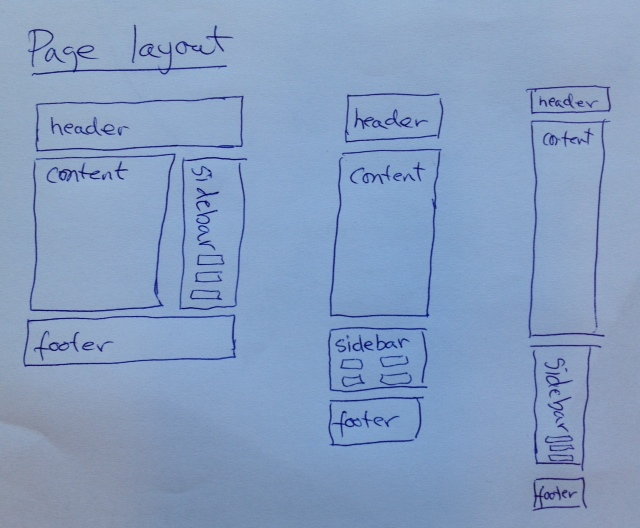
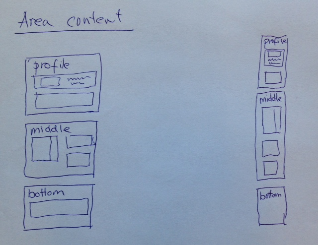

# Page layout

The page is divided into 4 regions.  We call them:

* Header
* Content
* Sidebar
* Footer

The layout within the *Content* region will vary depending on what kind of content we are looking at.
The other regions will contain content filled in from the area that the content belongs to.

We will lay them out like this (for fullwidth, tablet and mobile displays):

## Header region

* Field: area.title
* Field: area.logo\_image: image
* Field: area.meny_style (popup, expanded, hidden)

## Sidebar region

The boxes inside all take the full width of the region and are layed own in this sequence.

### Box1:

* Field: area\_parents

### Box2:

* View: last calendar entries (except utstilling)
* View: last calendar entries (utstilling only)

### Box3:

* View: last news

### Box4:

* Block: jobbnorge

### Box5:

* Block: rss

## Footer region

### Box1 (colophone)

* Field: area.ou.*

# Area content layout

The content region for areas are divided into 3 sub-regions.
We call them:

* Profile
* Middle
* Bottom

We will lay them out like this:

## Top region

The boxes inside take the full width of the region:

### Box1:

* Field: primary\_image
* Field: primary\_video
* Field: primary\_text: htmltext

Social media buttons:

* Field: social_media*: string

We represent social media with simple text fields where users enter the URL of
the service to link to or short forms like `"twitter:gisle"`,
`"facebook:34234134143"`, `"vimeo:234234234"`, etc.  The presentation code will
figure out which icons to use for these, and expand the URL if needed.  It
would also skip those not recognized.

> Gisle did consider using the [socialmedia
module](http://drupal.org/project/socialmedia) for this, but it only support
a single site wide profile (+ user profiles).  The user profile part might be
a cool feature to enable at some point.

### Box2:

* Field: secondary\_text: htmltext

Special rule: (with &lt;li> sections styled as multicols in fullwidth and tablet version)

### Box3:

* Field: profiled\_articles[0-4]: ref article

## Middle region

The boxes inside this region take half width and area layed
out with "float: left".

### Box1:

* View: list kid institutes
* Field: link\_section*

<pre>
    title: text
    links*:
        title
        url
        class
</pre>

* Field: boxed_links: bool

Some hack to to create individual buttons out of this structure.
For instance if the "title" is empty then lay out the links as buttons, or
just drive if from the class attribute.

### Box2:

* Field: profiled\_messages*: ref artikkel

### Box3:

* Field: tertiary\_text: htmltext

### Box4:

* Field: show\_staff: bool

### Box5:

* Field: profiled\_testimonial: ref testimonial

## Bottom region

The boxes inside take the full width of the region:

### Box1:

* Field: bottom\_image
* Field: bottom\_text: htmltext

