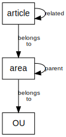

# W3 Developer Documentation

The w3 site is the 3rd generation implementation of [www.uib.no](http://www.uib.no).
It was introduced in 2013 and by fall 2014 it had replaced all of w2.
The site is implemented in [Drupal 7](http://drupal.org).

These pages documents the system from a developer perspective.
If you want to use the system and manage content you're better off reading the
[User and Editor Documentation Site](http://w3docs.h.uib.no/).

## Understanding the content structures

To be able to make sense of the code you should first understand the structure
of the content that makes up the web site.
The simplified view is shown here.
The central concepts are _areas_, _articles_ and _OUs (organisational units)_.

The site is divided into sub-sites, but instead of _sub-site_ we say _area_.
It's at least shorter. Each area get their own page on the web, their own set
of articles, and their own menu.

The OUs represent the organisational structure of university as seen by the
official systems (originates in the personnel system Paga). Areas are alway
connected to the OU that own them.  Many areas are the site of the OU itself,
which make it tempting to conflate these two concepts.

Articles contains the textual content of the site, and appear in the form of
news articles, pages, events, and others.  Articles belong to an area and are
presented using the area's header, side-bar and footer.  Articles also get URLs
that make them appear as subordinates of an area.

The [details of the content structures](model.html) is of course more complex than this and
is explained in a separate document.  The [terminology of this
project](terms.html) should also be understood.

 

## Understanding the code

To understand the code you need to understand [Drupal 7](http://drupal.org)
and the principles of its [API](http://api.drupal.org).

The configuration managed and used by Drupal comes from the database.
We use the `features` module to capture this configuration as code
and to restore configuration from code.
This allow us to manage versions and releases from Git.
We also write our own code, and all of this is organized in a set of
[site specific Drupal modules](modules.html).

Our source code is managed by Git in two repositories.  The root repository
contains our code and a separate sub-repository tracks the version of Drupal
and contributed modules we use.  The same sub-repository is used by other UiB
projects based on Drupal.  Commit messages should be prepended with a reference
to the [RTS issue](https://rts.uib.no/projects/w3) that caused this commit to
be made.

[Details of the repository layout](repo.html) is explained in
a separate document.
You can browse the w3 git repository on the web from either
[RTS](https://rts.uib.no/projects/w3/repository) or
[cgit](https://git.uib.no/cgit/site/w3.uib.no.git/tree/).

## Guides

* [Coding style (in Norwegian)](style.html)
* [Terminology](terms.html)
* [The code repository](repo.html)
* [Development setup](development-setup.html)
* [Reder Arrays](render-array.html)
* [Hints that's good to know](hints.html)
* [Git hints](git.html)
* [fs-pres](fs-pres.html)

* [Manpages  for commands](man1/)
* [Repo README](repo-readme.html)
* [API docs generated by Doxygen](api/)

## Releases

The current [release process](release-process.html)
is to aim for new releases every [14 days](release-notes.html).

## Reference

* [Manpages  for commands](man1/)
* [Repo README](repo-readme.html)
* [Git](https://rts.uib.no/projects/w3/repository) and [cgit](https://git.uib.no/cgit/site/w3.uib.no.git/tree/)
* [API docs](api/)
* [RTS](https://rts.uib.no/projects/w3)

### Stats and Logs

* [404-list and errorlogs](http://overvakning.app.uib.no/w3_logs/)
* [Staging log](http://attilatest.uib.no/status/drupal-daily-staging.last.txt)
* [Piwik stats](http://stats.uib.no/)
* [Awstats](http://overvakning.app.uib.no/awstats/awstats.pl?output=main&config=www.uib.no)
* [Munin](http://overvakning.app.uib.no/w3_hist.php?limit=2)

## Operational concerns

* [Deploy Drupal into production](drupal-deploy.html)
* [How to upgrade Drupal on w3.uib.no](drupal-update.html)
* [Production server layout](w3_server_layout.html)
* [Production setup](server-setup.html)
* [Course server setup](course_site-w3-kurs.uib.no.html)
  and [syncing](drupal-sync-course-site.html)

## Historic specifications

* [Initial spesification](spec.html) as of early 2012
* [Release 1](release1.html) med [innspill fra pilotfakultetene](doc/pilot-ny-funksjonalitet.pdf)
* [Area regions and fields](area.html)
* [Mockups](mockups/)
