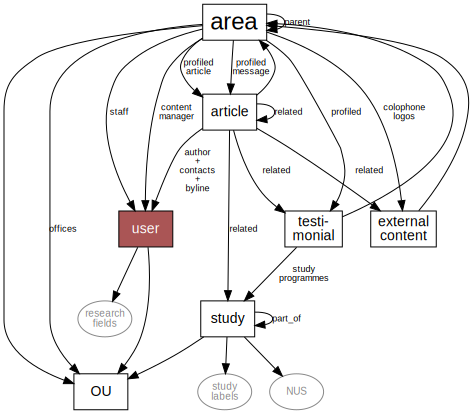
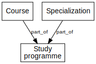

# Content model

The following diagram shows the entities found in the system and how they reference each other.

The gray rounded boxes are the vocabularies.
The _user_ is just the standard Drupal user object with some fields added.
The rest of the boxes (square and white) are the node types in the system.

## Area

The site is divided into sub-sites, but instead of _sub-site_ we call them
_area_. Each area get their own page on the web, their own set of articles
and their own menu.

Areas have a type field that is used for filtering in lists and to tweak
the presentation.
The area types are
faculty,
institute (department),
unit,
research group,
research school,
section,
discipline,
frontpage,
newspage,
phdpresspage,
and focus area.

The area nodes have lots of textual and media fields that's presented on
the main area page.  In addition it presents the _staff_ and other pieces of
profiled content.

Areas belong some place in the organisation represented by the reference
to the OU.

## User

Users are created and kept in sync with Sebra by integration scripts.

Users are tagged by their _research fields_ and belong somewhere officially in
the organization.  Users are references from the _area_ as _staff_ or _content
managers_.  Those that are staff is listed on the site.  Those that are content
managers can create and modify content the belongs to the area.
Users are referenced from _articles_ as _author_ or _contact_ or _byline_.

## OU

The OUs represent the organisational structure of university as seen by the
official systems (originates in the personnel system Paga).  The OU nodes
are created and kept in sync based on the places exposed by Sebra.

Areas, users, studies all belong somewhere in the organisation, thus have
references to some OU.

## Articles, Testimonials, and External Content

Articles contains the textual content of the site, and appear in the form of
news articles, pages, events, and others.  The testimonials and
external\_content are pretty much treated as articles, but get their own node
type because they have sufficiently different requirement on what fields to
be filled in.

Articles, testimonials and external content are created and maintained by
the users that are content managers of an area.

Articles belong to an area.  Articles are presented using the area's header, side-bar
and footer.  Articles also get URLs that make them appear as sub-ordinates of
an area.

Articles can be shared with other areas.

## Study

The study nodes represent either courses, study programmes, or specializations.
They have a type field that says which one.

A course is the smallest unit of education that students might attend. Courses
usually ends with an exam.  Based on how much effort it is to complete the
course the student earns ECTS credits (studiepoeng).

Study programmes are combinations of courses and other activites that will earn
the student an academic degree.  Major options within an study programme is
called specializations, but otherwise they are just like study programmes by
themselves.

 Manadatory courses and specializations are considered to be part of
certain study programmes.  These relationships are represented represented
using the part\_of reference between the study nodes.

Studies have a category field that encodes what level of degree they
lead to.  The special category _evu_ marks certain courses as "EVU courses"
(Continued education).  These have special rules for presentation.

The study nodes are created and kept up to date with integration scripts that
obtain information from FS via [fs-pres](fs-pres.html).

Content Managers of the Education area is allowed to modify certain fields,
like lead text and an illustration image.  This is normally only used for study
programmes.

Studies are classified using the NUS vocabulary and might also be tagged by
certain labels.  These together with the type and category field are used to generate
filtered lists in various forms.
