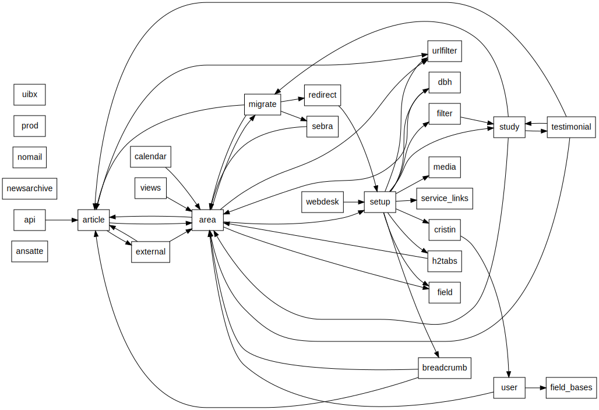

# Modules

The w3 application is currently implemented by 30 UiB specific Drupal modules.
Quite a few of these modules are fully or partially generated by the [features
module](http://drupal.org/project/features). We use features to capture
Drupal’s configuration as code and to restore configuration from code.

The following table lists all UiB specific modules.  The “#D” column is the
count of definitions provided: declared functions, classes, hooks, and nodes.
The “#F” column is the count of features provided.

<!-- generated by '../bin/umod list --html' -->
<table class="umod-list">
<thead><tr><td>Name</td><td>#D</td><td>#F</td><td>Description</td></tr></thead>
<tbody>
  <tr><td>uib_ansatte</td><td>0</td><td>5</td><td>Provide the staff view</td></tr>
  <tr><td>uib_api</td><td>3</td><td>0</td><td>Machine access to our data</td></tr>
  <tr><td>uib_area</td><td>152</td><td>183</td><td>Provides the area and area_type taxonomies.  Organisational units.</td></tr>
  <tr><td>uib_article</td><td>28</td><td>22</td><td>Define articles</td></tr>
  <tr><td>uib_breadcrumb</td><td>7</td><td>0</td><td>Override the default breadcrumb</td></tr>
  <tr><td>uib_calendar</td><td>0</td><td>12</td><td>Calendar listings and formats</td></tr>
  <tr><td>uib_cristin</td><td>4</td><td>0</td><td>Get data from CRIStin</td></tr>
  <tr><td>uib_dbh</td><td>5</td><td>3</td><td>Implements blocks and pages with data from DBH</td></tr>
  <tr><td>uib_devel</td><td>9</td><td>24</td><td>Add stuff that make it easier to inspect the system</td></tr>
  <tr><td>uib_external</td><td>3</td><td>18</td><td>Placeholder content type referencing external content</td></tr>
  <tr><td>uib_field</td><td>3</td><td>0</td><td>Contains modifications to fields</td></tr>
  <tr><td>uib_field_bases</td><td>26</td><td>27</td><td>Field bases for UiB</td></tr>
  <tr><td>uib_filter</td><td>2</td><td>0</td><td>Various UiB specific text filters</td></tr>
  <tr><td>uib_h2tabs</td><td>5</td><td>0</td><td>Contains recodings for article second level headers to tabs</td></tr>
  <tr><td>uib_media</td><td>1</td><td>0</td><td>Contains modifications to media module</td></tr>
  <tr><td>uib_migrate</td><td>31</td><td>0</td><td>Migrate data from w2</td></tr>
  <tr><td>uib_newsarchive</td><td>0</td><td>3</td><td>Provides pages and blocks that presents all the news articles for an area</td></tr>
  <tr><td>uib_nomail</td><td>1</td><td>0</td><td>Stops our sandbox from spamming</td></tr>
  <tr><td>uib_prod</td><td>0</td><td>9</td><td>Imposes the configuration that we want to apply to our production setup</td></tr>
  <tr><td>uib_redirect</td><td>0</td><td>14</td><td>Configuration of the redirect module</td></tr>
  <tr><td>uib_sebra</td><td>24</td><td>0</td><td>Synchronize data with Sebra</td></tr>
  <tr><td>uib_service_links</td><td>3</td><td>0</td><td>Extend services provided by the service links module.</td></tr>
  <tr><td>uib_setup</td><td>22</td><td>494</td><td>General dependencies and settings for w3.uib.no</td></tr>
  <tr><td>uib_study</td><td>88</td><td>52</td><td>Information about courses and study programs</td></tr>
  <tr><td>uib_testimonial</td><td>18</td><td>42</td><td>Define testimonials</td></tr>
  <tr><td>uib_urlfilter</td><td>7</td><td>0</td><td>Filter for removal of superfluous domain name</td></tr>
  <tr><td>uib_user</td><td>25</td><td>59</td><td>Set up fields for users</td></tr>
  <tr><td>uib_views</td><td>3</td><td>0</td><td>Collection of UiB specific Views overrides.</td></tr>
  <tr><td>uib_webdesk</td><td>7</td><td>12</td><td>UiB editorial interface</td></tr>
  <tr><td>uibx</td><td>6</td><td>0</td><td>A library of helpful tools by UiB for UiB (api only).</td></tr>
</tbody>
</table>

## Dependencies

The following diagram show the UiB specific modules and their declared
dependencies on other UiB modules (except dependencies on uibx which would make
the diagram too messy). The `uib_` prefix has been dropped. Most modules will
also have dependencies on core or contributes modules not shown here.

