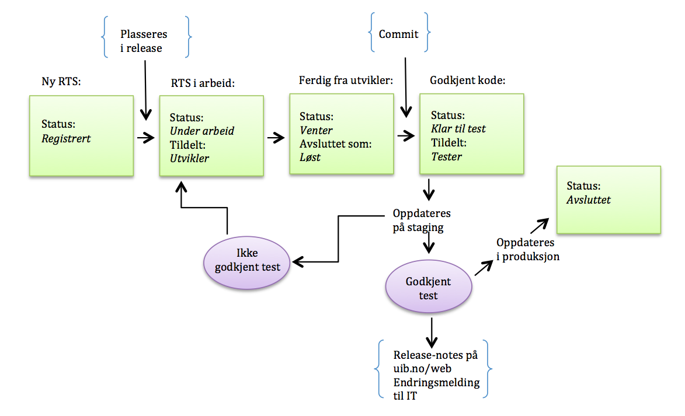

# Releaserutiner i webprosjektet

## Roller

### Prosjektansvarlig: Mathilde (vara:...)

- Ansvarlig for å legge opp releaseplan og nominere saker til release
- Annonserer releasene og release notes til brukere
- Lede fellesmøtene

### Releaseansvarlig: Gisle (vara: Stein Magne)

- Ansvarlig for å godkjenne kode til master

### Driftsansvarlig:  Mike (vara: Lennart, Gisle)

- Ansvarlig for test- og produksjonsmiljø, daglig drift og ytelse
- Overvåke sikkerhet-oppdateringer for Drupal (og modulene vi bruker) og applisere disse
- Ansvarlig for å oppdatere staging
- Ansvarlig for å oppdatere produksjon

### Testansvarlig: Mathilde (vara: Gisle)

- Ansvarlig for å fordele til test og verifisering i henhold til tidsskjema

### Utviklere:

- Ansvarlig for å designe og implementere funksjonalitet
- Ansvarlig for å identifisere/generere, diskutere og løse saker
- Ansvarlig for å teste lokalt saker en selv har løst
- Ansvarlig for å rette saker etter manglende verifisering

### Testere:

- Ansvarlig for å verifisere tildelte saker som er «Klar til test» på staging.
- Gjennomkjøring av testskript før release

### Prosjektdeltakere:

- Ansvarlig for ulike roller ut mot eller i organisasjonen
- Ansvarlig for å melde inn og diskutere feil, behov og ønsker

## Retningslinjer for release

1. Releaser i serien _R1.x_ opprettes fortløpende og etter behov for feilrettinger og generelle oppdateringer. Disse releasene er tidsbaserte, og saker vil bli flyttet ut av release om de ikke er løst i henhold til tidsfristene (se pkt. 7).

2. Større releaser (_R2_ etc) opprettes knyttet til flytting av hele områder og evt ny funksjonalitet knyttet til disse.  Disse releasene er featurebaserte og vil ha en flytende dato, avhengig av når funksjonalitet knyttet til release er ferdig utviklet. De vil imidlertid være overordnet tidsstyrt på måned etter planlagt migrering og flytting av område.

3. Sub-prosjektet "Ideas" benyttes for idéer som representerer ny funksjonalitet uten spesiell tilknytning til øvrige releaser.
Alle prosjektdeltakere oppfordres til å bidra til nye idéer og registrere disse.

4. Prosjektansvarlig avgjør hva som skal prioriteres inn i en release

5. Releasansvarlig avgjør hvilke løste saker som kan merges og settes til "Klar til test".  Releaseansvarlig gir tilbakemelding på "løste" saker som ikke oppfyller kravene til å merges ("code review").

6. For at en sak skal komme med i release, må den være løst og akseptert innen et minimum av to arbeidsdager før releasedato.

7. For at en sak skal komme med i release, må den være ferdig testet seinest arbeidsdagen før releasedato.

8. Eventuelle unntak fra pkt 6 og 7 kan gis av Releaseansvarlig

9. Releaseansvarlig er den eneste som får flytte saker UT av release etter at de har fått status "Klar til test".

10. Release skal angi dato og klokkeslett i RTS.

## Arbeidsflyt i RTS

- Vi bruker engelsk i beskrivelsen og oppfølgingen av sakene våre i RTS.

- Saker som registreres i RTS legges som «Registrert» og i utgangspunktet som "Unscheduled". Løpende småsaker kan også legges rett i «R1.x».  Mer luftige idéer registreres i subprosjektet "Ideas".

- Den som registrerer saken er ansvarlig for å gi en utfyllende beskrivelse av behovet som skal fylles/feil som skal rettes.
Det er kan være nyttig å beskrive saken ut fra hva en tester må gjøre for å verifisere at saken er løst.

- Sakene tildeles eller plukkes etter avtale. Utvikler og tester er ansvarlig for å følge opp egne saker gjennom release. En sak som står som «Registrert» kan plukkes av en utvikler selv om saken opprinnelig er tildelt en annen.

- Når utvikler begynner å jobbe med en sak, endres status fra «Registrert» til «Under arbeid»

- Endringer i koder tilknyttet en sak commites på en branch som har navn på formen 'rts/_###_' (hvor '_###_' er saksnummeret i RTS).
Legg inn kommentarer i RTS saken som refererer til denne.  Referanser på formen "commit:_deadbeef_" blir lenker til Git presentasjonen i RTS.

- Når man har løst en sak, settes status til «Klar til kontroll» og Avsluttet som: «Løst».

- Releaseansvarlig flytter saker til "Kontrollert" når den er gjennomgått, godkjent og merget inn i master.

- Når saker er blitt [staget på www.test.uib.no](http://www.test.uib.no) får de tilstand «Klar til test».

- Saker tildeles for testing av Testansvarlig.  Den som har løst saken (utvikler) kan _ikke_ selv være tester.

- En sak som testes og ikke godkjennes, settes tilbake til utvikler og endrer status fra «Klar til test» til «Under arbeid». Saken må få beskrivende kommentar på hva som ikke er godkjent i test.

- En sak som er testet og godkjent, endres status fra «Klar til test» til «Verifisert» av den som har testet saken. Saken skal også gis en beskrivende kommentar om hvordan den er testet.

- Releasen er klar til produksjonsetting når alle sakene som inngår er satt til  «Verifisert».

- Når release er oppdatert på produksjon, endrer Releaseansvarlig status fra  «Verifisert» til «Avsluttet» for alle sakene som inngår i releasen.  Deretter stenges releasen i RTS (hindrer at nye saker kan tilordnes).

### Tidstandsdiagram for RTS-saker

_Dette diagrammet er desverre foreldet.  Det har ikke med tilstandene "Klar for kontroll" og "Kontrollert"._

## Release notes

- Prosjektansvarlig er ansvarlig for å skrive [release-notes](release-notes.html). Release notes vedlikeholdes i git og en kopi publiseres på <http://w3docs.h.uib.no/> etter hver release.
- Ansvarlig for drift registrerer [endringsmelding](https://bs.uib.no/?module=change&action=new) til IT (minst 2 dager før release).

## Faste prosjektmøter

### Onsdag kl 9:30

Møtet åpner for bred informasjonsutveksling fra alle deler av prosjektet, overordnet blikk på tidsplan og problemstillinger.

- Varer maks én time
- Inneholder: informasjon på tvers i prosjektet, statusrunde blant alle prosjektdeltakere, gjennomgang av rts, eventuelt
- Alle er ansvarlig for å møte forberedt til å kunne redegjøre for egne oppgaver

### Fredag kl 9:30

Møtet fokuserer på oppgaver i RTS og nærmeste release.

- Varer maks en halv time
- Inneholder: statusrunde, gjennomgang av rts, eventuelt
- Alle er ansvarlig for å møte forberedt til å kunne redegjøre for egne oppgaver
