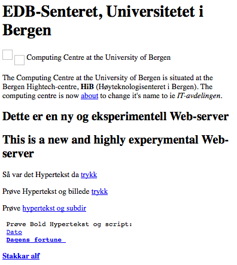
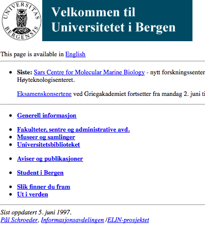
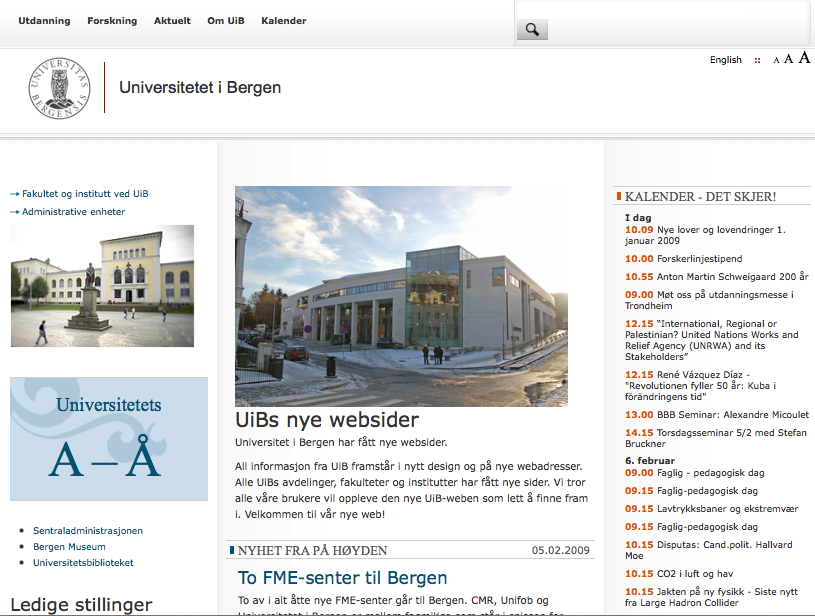

# Terminology

This documents the terminology that we use in UiB’s Web Project.

We standardize on using English for our code and the text written for our [RTS
issues](https://rts.uib.no/projects/w3/issues).  This document
displays the corresponding Norwegian term after the bar (if known or
different).

Within each section the terms are ordered alphabetically.

## Site

This section contains usages of terms that are specific for our site.

### Area | Område

The website is partitioned into areas that are basically their own sub-sites.
_Articles_ belong to an area and can be edited by the _content managers_ of the
area.  Areas have their own menu.  Content belonging to an area is currently presented
together with the area’s header, sidebar and footer.

Areas form hierarchies, but don’t inherit stuff from their parent(s).  This
is used mainly to reflect the organizational structure; for instance to present
that certain _departments_ are part of some _faculty_.

Areas are associated with a _place_; what part of the university organisation
that owns this area.

Areas have type that are used to influence how they are presented.  The types
are identified by strings like "faculty", "institute", "unit", "discipline", "frontpage",...

### Article | Artikkel

_Content type_ centered around a piece of text, some images and related meta
information.  Almost all content on the UiB website are articles.  Articles are
divided into subtypes like _news article_, _info page_, _event_.

### Calendar | Kalender

Index over _events_.  Each _area_ have their own calendar; and we have a
calendar that spans all areas; the one we call the global calendar.

### External Content | Eksternt innhold

_Content type_ that represents of some resource on the web.  Mainly used to make
it possible to add such resources as related content to _articles_.

### Event | Kalenderoppføring, Hendelse

_Article_ with (&lt;from>, &lt;to>) timestamps.  Represents announcement of some
scheduled event, like a meeting, a conference, a lecture.

### Exhibition | Utstilling 

A different class of _event_. Mostly their own class so that we can
present them in separate lists.

### Info Page | Infoside

_Article_ that represents a page with information about something.
Top level info pages get their own menu entries referencing them.
Info pages can form a hierarchy by referencing their related content.

### Navigation Page | Navigasjonsside

Retired concept used by _w2_.  These pages are now just _info pages_ with related content.

### News Article | Nyhet

_Article_ containing a story about something that is new and noteworthy.

### News Archive | Nyhetsarkiv

Index over _news articles_ organized by month/year.

### Testimonial | Vitnesbyrd

_Content type_ that represents a quote and how-it-went story by some former
student.  Testimonials are connected to specific studies that this person
attended.  Testimonials were found different enough that these are not _articles_.

### Sebra

Central system at UiB to manage our user accounts, authentication and access
control.  The website synchronizes its user database and list of content
managers for each area from [Sebra](http://sebra.uib.no).

### w1

Version 1 of UiB’s web site.  Implemented mostly as a static site, but also
contained a few CGI scripts and later some PHP scripts. Introduced in
[1993](http://alfred.uib.no/det.var.tider/) and parts of it is unfortunately
still going strong; served from webber.uib.no. The first versions ran on
alf/alfred.uib.no using the [NCSA web
server](http://en.wikipedia.org/wiki/NCSA_HTTPd).  In 1995 webber.uib.no showed
up in the form of a [flashy blue SGI
box](http://en.wikipedia.org/wiki/SGI_Indy).  Webber has had various
incarnations, like being an Solaris box and is today a virtual RHEL box.

### w2

Version 2 of UiB’s web site.  [Implemented in
Zope/ZTM.](https://git.uib.no/cgit/site/www.uib.no.git/)  Most of it
implemented by [Bouvet](http://bouvet.no).  Introduced in 2009 and retired in 2014.

### w3

Version 3 of UiB’s web site.  Implemented in Drupal. Introduced in 2013.

### Webdesk

[Set of pages](http://www.uib.no/webdesk) on the web site where the content
managers can find, do stuff with the content that are relevant to them.

## Web Publishing

This section contains terms used in (web) publishing that might not be
generally know, thus it makes sense to define them the way we use them.

### Byline

The persons presented as author(s) of some article.  News articles usually have
bylines.  Gets its name from the form it normally takes: “By &lt;name>”.

### CMS

Content Management System; Some denote Drupal a CMS, but it’s actually
more of a system to build CMSes.

### Colophone (sic) | Kolofon

In our site this is the footer, declaring who is responsible for the content
belonging to the area.  In general [publishing terms
colophon](http://en.wikipedia.org/wiki/Colophon_(publishing)) (without the 'e')
is the text you see on the back of the first page of a book; where you see who
the publisher is, what edition and where and when this book was printed.

### Content | Innhold

_Articles_ and other published stuff managed by a CMS.
In Drupal the term is used as a synonym for _node_.

### Content Strategy | Innholdsstrategi

Principles for how to structure and build _content_.  _Content_ ought to be structured
and have a form such that it is reusable in different contexts.  We want to
present the same underlying content both on web-pages, for mobile apps, and for
printing.  Content is the most valuable assert of a site and should be future prof.
Pieces of the content should be extractable by automatic processes.

### Fact Box | Faktaboks

Some short list of basic facts about the matter that an _article_ story
describes.

### Kicker | Stikktittel

Title for the title of an _article_.

<http://desktoppub.about.com/od/glossary/g/kicker.htm> says:
Kicker, a piece of additional information printed as an accompaniment to a news headline.
It is a subordinate clause and comes in present tense. The point size is usually smaller and
is placed on top of the headline. When it is placed under the headline it is called a rider. It is
a term common with journalists, especially sub editors.

### Lead | Ingress

[Short summary](http://en.wikipedia.org/wiki/lead_paragraph)
of the content of an _article_.

### RSS-feed

Chronological index of _news articles_ expressed in machine readable xml.
More info from [Wikipedia on RSS](http://en.wikipedia.org/wiki/RSS) or
the [original RSS spec](http://scripting.com/netscapeDocs/RSS%200_91%20Spec,%20revision%203.html).

### Slug

Some [readable string that identifies an
object](http://en.wikipedia.org/wiki/Slug_(web_publishing)).  Used to create
readable urls. We use it for instance to identify UiB’s users with strings like
"&lt;firstname>.&lt;lastname>".

## Organization

### Affiliated Person, External Person | Ekstern person

_Persons_ that are neither _staff_ nor _student_, but should still have access
to the university systems.  These could for instance be _staff_ at some
organization that is related to the university, but not really the university;
like "Uni Research".

### Department | Institutt

The level below _faculty_.
For instance "Department of Foreign Languages".

### Faculty | Fakultet

Top level organization of the non-administrative parts of university.
For instance "Faculty of Humanities".

Most _faculties_ are sub-divided into _departments_.

In general _faculty_ also denotes the teaching staff at the university.
We don’t use this term for that (yet).

### Person

An human being.  Can take on one or more of the roles "staff", "student", "affiliated".

### Place, Organization Unit, OU | Sted

Hierarchical description of the university organisation.
Concept shared with Paga and Sebra.  We import all the places from Sebra.

### Place ID | Stedkode

3x2-digit code that identifies _places_.  The hierarchy of _places_ is expressed
by the code.  For instance:

    110000 Det humanistiske fakultet
    112000   Institutt for fremmedspråk
    112055     Kinesisk

First two digits encode the _faculty_ as well as other top level divisions.
Next two digits encode the _department_ or _units_.  Last to digit encode the
_division_ within.

These numbers are allocated in Paga.

### Position | Stilling

The official title for the kind of competence/work a _person_ is hired for.  At
the university the position is quite general; like "professor" or "senior
consultant".

### Position Detail | Funksjon

Addition to the _position_ to express what job some _person_ is currently hired
to do.

### Research Group | Forskergruppe

Organization around research projects.

### Research School | Forsningsskole

Organization of the phd production.

### Sebra User | Sebrabruker

A user account managed by _Sebra_.  These _usernames_ for these accounts currently
take the form "aaa999" or "st99999".

### Staff | Ansatt

A _person_ that gets their salary from the university.

### Student

a _Person_ that attend _courses_ at the university.

### Unit, Division | Avdeling

The administrative part of the university is divided into units.  For instance
"division of communication".  One could argue that some units are misnamed like
the "it department" (not to be confused with "department of informatics").

### User, Account | Bruker

Account on the university computer systems that allow _persons_ (or machines)
to gain access.  Each _person_ have their own personal account but might have
access to other accounts.

### Username | Brukernavn

A (short) string that identifies a _user_.

## Subjects

This section describes terms related to the university’s subjects of study.

### Cristin

System used by all researcher in Norway to register all work of science that’s
been done.  All papers go here, but also entries for when some researcher has
been mentioned in media. This is the [CRIStin site](http://www.cristin.no).

### Discipline | Fag

Another term that basically justs mean subject of study once more.  we use this
term as an _area_ type.

### NUS

[Official Norwegian
taxonomy](http://www.ssb.no/utdanning/norsk-standard-for-utdanningsgruppering)
describing subjects of study.

## Studies

This section defines the terms we use for the concepts related to
the education offered by the university.

### Bachelor program | Bachelorprogram

The first education degree to earn at the university.

### Course | emne

The smallest unit of education that students might attend.
Usually ends with an exam.

Courses are identified with a code like "INF101".

### ECTS credits | Studiepoeng

A number that describe the amount of effort required to attend a study.

### EVU, Continuing Education | EVU, Etter- og videreutdanning

The university offers our _courses_ to people that need to refresh or expand on
what they know.  Attendance of these _courses_ are often sold for a significant
fee.

### EVU Course | Kurs

A _course_ prepared to be offered to non-students as part of the EVU effort.

### EVU Course Instance | Kurs instans

The instance involves a specific dates and a price to sign up for attending the
course at the given time.

### FS | Felles studentsystem

A [system](http://www.fellesstudentsystem.no) that the universities of Norway
use to manage courses and study programmes.  [UiB’s version of
FS](https://wikihost.uib.no/uawiki/index.php/Felles_studentsystem_(FS)) exposes
the information on _studies_ through an API called
[FSrest](http://apidoc.app.uib.no/system/fs.fd.html).  We use a service called
[fs-pres](http://fs-pres.app.uib.no) to convert this into a more sensible API
usable for on-the-fly rendering of _study_ information.

### Master Programme | Masterprogram

If have not had enough after you done your Bachelor.

### One Year Programme | Årsstudium

I guess this is a study that it takes one full year to complete ;-)

### PhD

Education that prepare you to become a researcher.

### PhD Course | PhD kurs

Couses you take as part of your PhD.

### Semester

The year at the university is divided into two semester; spring and fall.

### Specialization, Programme option | Studieretning

Really just a study programme, but treated as if it’s an option you can choose
when you apply for a study programme.

### Student

A _Person_ that attend _courses_ at the university.

### Study

Either a _course_ or a _study programme_.

### Study Level | Studienivå

A set of codes that describes how advanced the study is.

### Study offer | Studietilbud, Overbygning

Collection of _EVU Courses_ that naturally belong together.

### Study programme | Studieprogram

A combination of courses that will make you earn an academic degree.

## Drupal

The _w3_ website is implemented using [Drupal](http://drupal.org/).
Drupal is a system that can be used to describe content, manage it
and publish it on the Web.
This section defines the Drupal concepts that you need to understand
to do development work on the university website.

### Block

Piece of HTML that can be placed in a _region_ on a _page_.

### Bundle

Subtype of some Entity type.

For _nodes_ the _content type_ is the bundle.
For _taxonomies_ the _vocabulary_ is the bundle.

### Comment

_Nodes_ can have associated comments if you chose to.
We generally don’t for this web site.

### Content

In most cases the same as _Node_.  Historically all content
on a Drupal site were _nodes_, but since Drupal 7 you are able to
define other _entities_ that could represent content as well.

### Content type

The type of a _node_.  In our system the _content types_ are _Article_,
_Testimonial_, _Study_, _External content_.

Historically called node type.

### Context

A term that can mean many things.

We use the `context` module to place _blocks_ on the _pages_.

### Cron

Drupal invokes cron periodically do various cleanup actions, like expiry of
caches.

### Entity

Corresponds to objects in OOP.

Entities are stuff that can have their _field_ values filled in.

### Entity type

Corresponds to classes in OOP.  Drupal comes out-of-the-box with the entity
types _node_, _comment_, _taxonomy_, _user_.  Modules can declare additional
entity types.

### Feature

Collection of Drupal configuration written to source code files.  The actual
Drupal configuration always comes from the database.  Features can be updated
from the database configuration or enforced on the database configuration.

Features allow the Drupal configuration to be stored in git.

### File

A blob not stored in the database but still tracked by Drupal.
Images related to _content_ are files.

### fid (file id)

Files are identified by their numeric ID by Drupal.

### Field

_Entities_ have fields.  Each _field type_ is stored in a separate database
table.

### Field type

Declaration of the name and allowed set of values and cardinality that a field
might take.

Each _field type_ is stored in a separate database

### Hook

Callback function from the Drupal core.  Modules implement hooks to declare the
stuff they provide and influence what stuff comes out of Drupal.

### Layout

How _pages_ are divided into sections.

### Menu

Hierarchical list of &lt;title>, &lt;url> pairs.
Menus can take on the role of being a _block_.

### mlid (menu link id)

The numeric identifier that Drupal uses to track each menu entry.

### Module

Piece of code that can be enabled for a Drupal site.
When enabled it might influence how Drupal works by implementing _hooks_.

### nid (node id)

The numeric identifier that Drupal uses to track _nodes_.

### Node

Content in Drupal are of class Node.  The canonical _path_ to the nodes in a Drupal system are `node/<nid>`.

### Page

What Drupal returns in response to an HTTP request.  The page will normally be
converted into HTML before delivery.

### Path

The part of an URL that comes after the first slash following the host name, and before the '?' if present.

Drupal responds with _pages_ when paths are requested.  Drupal has a system for
aliasing of paths.  The purpose of this is to provide human friendly paths to
the users of the system.

### Permission

The set of operations that _users_ with the given _role_ are allowed to do.

### plid (parent (menu) link id)

The hierarchy of menus are expressed by having each of the menu entries point
to their parent.

### Region

Rectangular area on a _page_ where _blocks_ might be placed.

### Render

The process of turning a _render array_ into HTML.

### Render array

Nested PHP arrays that can be converted into HTML.
We have a [separate document](render-array.html) that describes this in detail.

### Revision

Each time a _node_ is saved we store the new set of values as a persistent
snapshot in what’s called a revision.  This allow node content to be compared and
restored to earlier versions of itself.

### Role

_Users_ have take on roles.

### Setting

A configuration attribute.  Settings can be turned into code by including them
in a _feature_ module.

### Site

The configuration activated for some (virtual) host name.

### Taxonomy

A set of _terms_ that is used to classify content.

### Term

A _taxonomy_ object.

Terms are basically tuples of (&lt;tid>, &lt;vid>,
&lt;name>) where &lt;tid> is unique.  Nodes become associated with terms
by adding a field that reference the &lt;tid>.

### Text format

The configuration of _text filters_ and _permissions_.  Text fields
are assigned a text format.

### Text filter

Function that modifies text fields before they are rendered as HTML.

### Theme

A special kind of _module_ that set up the look&feel of the site.

### tid (term id)

The numeric identifier that Drupal uses to track _vocabularies_.

### Token

A simple template system used by Drupal.

### uid (user id)

The numeric identifier that Drupal uses to track _users_.

### User

The _entity_ that tracks the accounts that can access the system.
We make the Drupal users have names that match the _Sebra users_
of UiB.

### vid (vocabulary id)

The numeric identifier that Drupal uses to track _vocabularies_.  For some
reason _vocabularies_ doesn’t have a textual name like _content types_ have.

### View

Lists of content provided as a _block_.

The stuff that the `views` module provide.  Basically an SQL select statement
with declarations about how to turn the result of it into HTML.

### View mode

A named way to render an entity.  The configuration of how fields display
can be set up differently for different view modes.

### Vocabulary

A _taxonomy_ class.  Our site uses the vocabularies "NUS", "Research Field" and
"Study labels".
