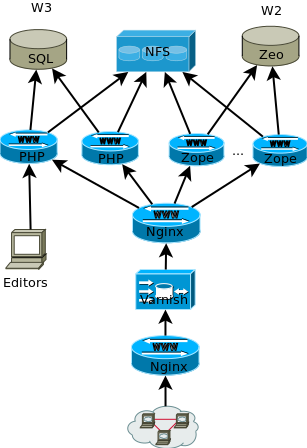

# Server layout

* String
** Nginx frontend
        Varnish (Web-cache)
        Nginx load-balancer
        W2-editing
* Attila
        Drupal web server
        W3 edting
        Cron-jobs
* Attika
        Drupal web server
* ng01
        NFS for w3
        NFS for w2
* w3.pg.uib.no
        SQL-server
* ew1
        Zeo database server
* int,struct,object
        Zope server
* teststing
        Test-server for string
        cache for w2's topicmap
* testbool
        cache for sebra
* attilatest
        testserver for attila
        staging-server
        course-server
