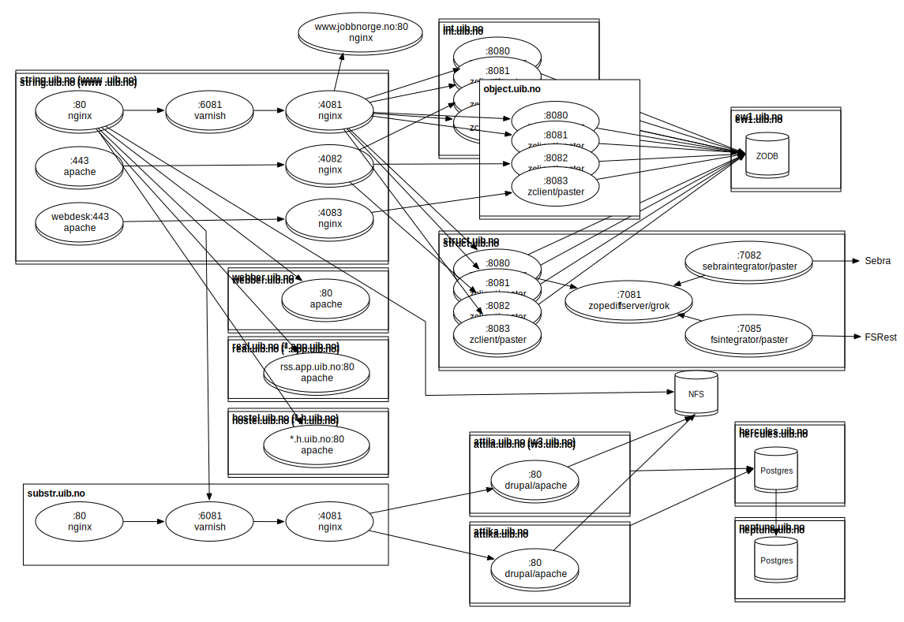

# Server layout

* String

  * Nginx frontend
      * Varnish (Web-cache)
      * Nginx load-balancer
      * W2-editing

* Attila
      * Drupal web server
      * W3 edting
      * Cron-jobs

* Attika
      * Drupal web server
* ng01
      * NFS for w3
      * NFS for w2

* w3.pg.uib.no
      * SQL-server

* ew1
      * Zeo database server

* int,struct,object
      * Zope server

* teststing
      * Test-server for string
      * cache for w2's topicmap

* testbool
      * cache for sebra

* attilatest
      * testserver for attila
      * staging-server
      * course-server

## Virtualhosts

### w3-staging.uib.no

w3-staging contains is the staging-vhost, and is located on attilatest.

### www.test.uib.no

www.test.uib.no if the staging-frontend, and contains the same functions as http://www.uib.no.

To flush the varnish-cache, download the page http://www.test.uib.no/varnish\_flush. The cache will be flushed with in 2 min. The page will return a 404 page not found.

The redirects that are in nginx may be out of date.
